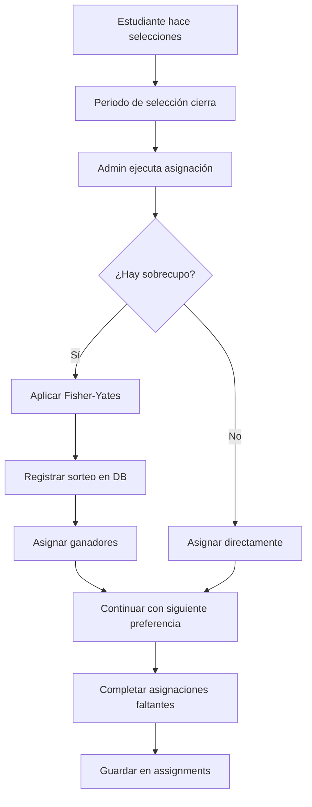

# 🎲 Sistema de Registro de Sorteos

## Descripción

El sistema de asignación de cursos implementa un **mecanismo de sorteo justo y auditable** cuando la demanda de un curso excede su capacidad.

## ¿Cuándo se realiza un sorteo?

Un sorteo se activa automáticamente cuando:

1. **Más estudiantes solicitan un curso** que cupos disponibles en ese momento
2. **Todos tienen la misma prioridad** (mismo nivel de preferencia)

### Ejemplo:

- **Curso:** Programación I (Paralelo 1)
- **Cupos disponibles:** 10
- **Estudiantes regulares que lo pusieron como 2ª preferencia:** 25
- **Resultado:** Se realiza sorteo entre los 25 estudiantes → 10 ganan, 15 pierden

## Algoritmo de Sorteo

El sistema utiliza el **algoritmo Fisher-Yates shuffle**, que garantiza:

- ✅ **Equidad matemática:** Cada estudiante tiene exactamente la misma probabilidad
- ✅ **Aleatoriedad real:** No hay sesgos ni patrones predecibles
- ✅ **Transparencia:** Se registra quién participó y quién ganó

### Código del algoritmo:

```typescript
// Fisher-Yates Shuffle
const shuffled = [...students];
for (let i = shuffled.length - 1; i > 0; i--) {
	const j = Math.floor(Math.random() * (i + 1));
	[shuffled[i], shuffled[j]] = [shuffled[j], shuffled[i]];
}
// Tomar solo los primeros N estudiantes (según cupos disponibles)
studentsToAssign = shuffled.slice(0, availableSpots);
```

## Orden de Prioridad

Antes de llegar al sorteo, el sistema prioriza en este orden:

### 1️⃣ **Estudiantes Prioritarios**

- Todos los estudiantes de 4to medio
- Estudiantes de 3ro medio con neurodivergencia
- **Ventaja:** Se les asignan sus cursos ANTES que a los estudiantes regulares

### 2️⃣ **Estudiantes Regulares**

- Estudiantes de 3ro medio sin neurodivergencia
- Se procesan DESPUÉS de los prioritarios

### 3️⃣ **Orden de Preferencias**

Dentro de cada categoría:

- **1ª preferencia:** Se procesa primero
- **2ª preferencia:** Se procesa después
- **3ª preferencia:** Se procesa al final

### 4️⃣ **Sorteo (si hay sobrecupo)**

Si varios estudiantes del mismo tipo compiten por los mismos cupos en la misma preferencia, se sortea.

## Modelos de Base de Datos

### Tabla `lotteries`

Registro de cada sorteo realizado:

```prisma
model Lottery {
  id              String         @id @default(uuid())
  course_id       String         // Curso sorteado
  course_name     String         // Nombre del curso
  parallel        Int            // Número de paralelo (1, 2, 3)
  preference      Int            // Nivel de preferencia (1, 2, 3)
  candidates      Int            // Total de candidatos
  available_spots Int            // Cupos disponibles
  executed_at     DateTime       @default(now())

  lottery_results LotteryResult[]
}
```

### Tabla `lottery_results`

Resultado individual para cada estudiante:

```prisma
model LotteryResult {
  id            String   @id @default(uuid())
  lottery_id    String   // FK a Lottery
  student_id    String   // ID del estudiante
  student_email String   // Email del estudiante (para auditoría)
  won           Boolean  // true = ganó, false = perdió

  lottery       Lottery  @relation(fields: [lottery_id], references: [id])
}
```

## Scripts Disponibles

### 1. Ver Registro de Sorteos

```bash
npm run db:view-lotteries
```

**Muestra:**

- Lista completa de sorteos realizados
- Ganadores y no seleccionados de cada sorteo
- Estadísticas generales (tasa de éxito, sorteos por curso, etc.)

**Ejemplo de salida:**

```
🎲 SORTEO #1
────────────────────────────────────────────────────────────────────────────────
   📚 Curso: Programación I (Paralelo 1)
   🎯 Preferencia: 2ª
   👥 Candidatos: 25
   🎟️  Cupos disponibles: 10
   📅 Fecha: 17/10/2025, 20:30:15

   ✅ Ganadores (10):
      ✓ juan.garcia15@institucion.edu
      ✓ maria.lopez28@institucion.edu
      ...

   ❌ No seleccionados (15):
      ✗ pedro.martinez3@institucion.edu
      ✗ ana.rodriguez42@institucion.edu
      ...
```

### 2. Ejecutar Asignación (con sorteos)

```bash
npm run db:test-assignment
```

Este script:

1. Lee todas las selecciones de la base de datos
2. Ejecuta el algoritmo completo de asignación
3. **Registra automáticamente los sorteos** en la base de datos
4. Muestra estadísticas finales

### 3. API de Asignación (para administradores)

```http
POST /api/admin/assign-courses
Authorization: Bearer <admin-token>
```

La API también registra sorteos automáticamente.

## Auditoría y Transparencia

### ¿Qué se registra?

Para cada sorteo:

- ✅ Fecha y hora exacta del sorteo
- ✅ Curso y paralelo afectado
- ✅ Nivel de preferencia (1ª, 2ª, 3ª)
- ✅ Número total de candidatos
- ✅ Cupos disponibles
- ✅ **Lista completa de participantes**
- ✅ **Resultado individual** (ganó o perdió) para cada uno

### Casos de Uso de Auditoría

1. **Reclamos de estudiantes:**

   - "¿Por qué no quedé en Programación I?"
   - Respuesta: Consultar `lottery_results` → mostrar que perdió el sorteo

2. **Transparencia institucional:**

   - Publicar estadísticas de sorteos
   - Mostrar que el proceso es justo (tasa de éxito = cupos/candidatos)

3. **Análisis de demanda:**
   - Identificar cursos con alta demanda constante
   - Ajustar capacidades para futuras iteraciones

## Consultas SQL Útiles

### Ver sorteos de un estudiante específico:

```sql
SELECT
  l.course_name,
  l.parallel,
  l.preference,
  lr.won,
  l.executed_at
FROM lottery_results lr
JOIN lotteries l ON lr.lottery_id = l.id
WHERE lr.student_email = 'juan.garcia1@institucion.edu'
ORDER BY l.executed_at DESC;
```

### Ver sorteos de un curso:

```sql
SELECT
  course_name,
  preference,
  candidates,
  available_spots,
  executed_at
FROM lotteries
WHERE course_name = 'Programación I'
ORDER BY executed_at DESC;
```

### Estudiantes que perdieron más sorteos:

```sql
SELECT
  lr.student_email,
  COUNT(*) as sorteos_perdidos
FROM lottery_results lr
WHERE lr.won = false
GROUP BY lr.student_email
ORDER BY sorteos_perdidos DESC
LIMIT 10;
```

## Flujo Completo del Sistema



## Garantías del Sistema

✅ **Justicia:** Todos los estudiantes en la misma categoría y preferencia tienen igual probabilidad

✅ **Transparencia:** Todo sorteo queda registrado con participantes y resultados

✅ **Trazabilidad:** Se puede auditar cualquier decisión del algoritmo

✅ **Reproducibilidad:** Los registros permiten explicar cualquier asignación

## Configuración

No requiere configuración adicional. El sistema de sorteos se activa automáticamente cuando es necesario durante la ejecución del algoritmo de asignación.

## Soporte

Para consultas sobre el sistema de sorteos:

- Revisar logs con `npm run db:view-lotteries`
- Consultar la tabla `lotteries` en Prisma Studio (`npm run db:studio`)
- Ejecutar queries SQL personalizadas según necesidad

---

**Última actualización:** Octubre 2025  
**Versión del algoritmo:** 1.0 (Fisher-Yates con registro completo)
